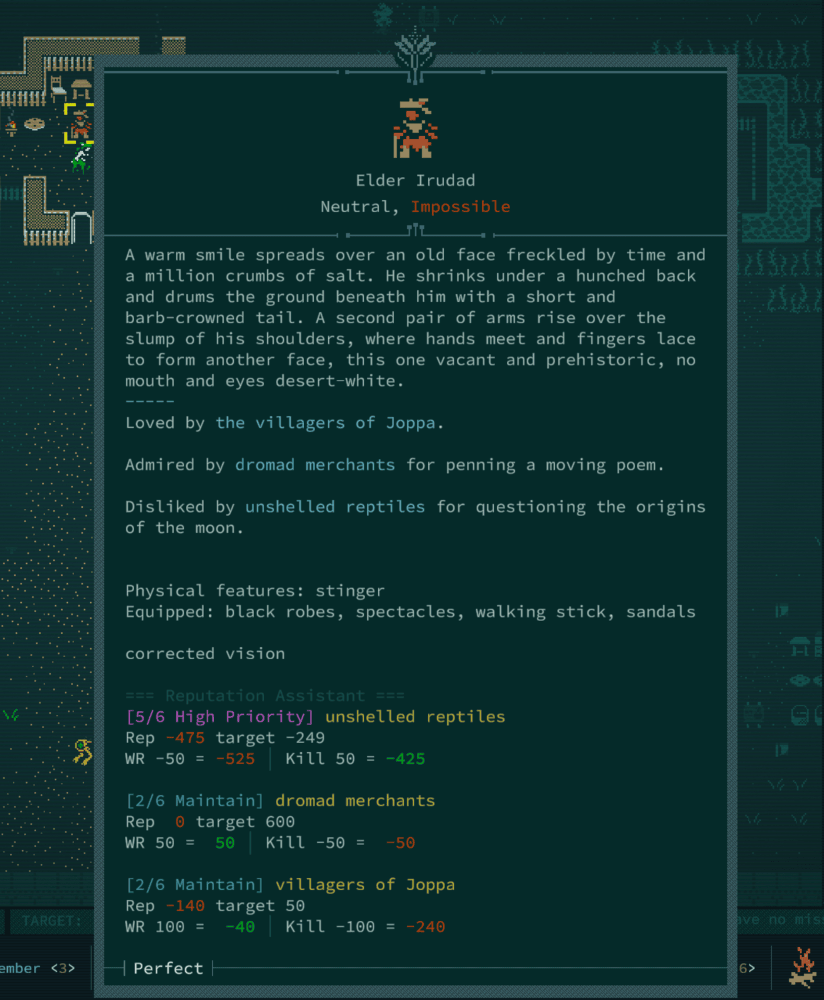
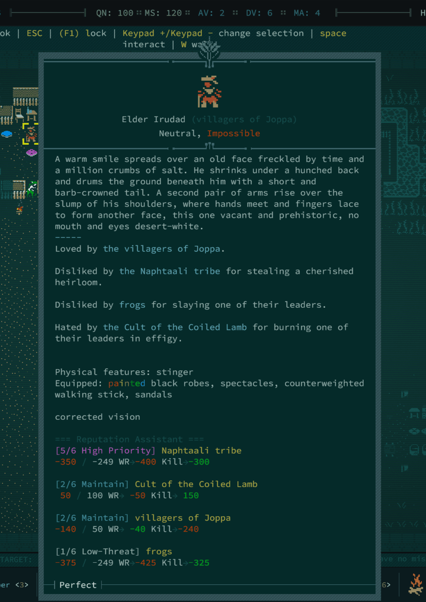
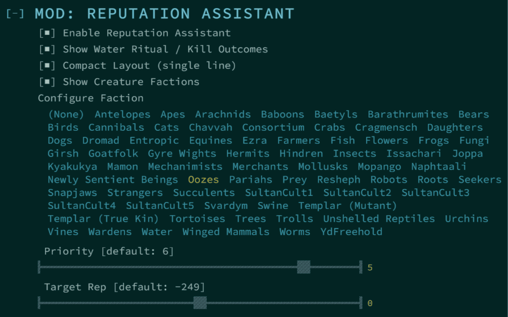

# Reputation Assistant 

A [Caves of Qud](https://store.steampowered.com/app/333640/Caves_of_Qud/) mod that adds opinionated strategic reputation tracking to the creature inspection popup.

When looking at any creature that participates in the reputation system (legendaries, named characters, anyone with the `GivesRep` part), the mod appends a compact tracker to the bottom of the description showing:

- **Strategic importance** of each related faction on a 0-6 scale, so you know at a glance which factions matter
- **Current reputation vs. target** — are you where you need to be?
- **Projected outcomes** for Water Ritual and Kill — see the exact resulting reputation, color-coded by safety

No more alt-tabbing to the wiki or the faction list. Just look at the creature and know.

<table>
  <tr>
    <td>
      
       
    </td>
  </tr>
  <tr>
    <td>
      
    </td>
  </tr>
</table>

## Why This Exists

Caves of Qud has one of the deepest reputation systems in any roguelike. Dozens of factions, interconnected relationships, and real consequences for every Water Ritual and every kill. But the game gives you almost no tools to reason about it in the moment.

You look at a legendary ape and think: _Can I safely do the Water Ritual? What factions are involved? Am I already above my target? Will killing this creature tank a faction I care about?_

I got tired of tracking my reputation by digging through the reputation list before deciding whether to Water Ritual, fight, or flee.

This mod puts that information exactly where you need it — in the look popup. The priority tiers come from A-F-F-I-N-E's [qudzoo.com reputation guide](https://www.qudzoo.com/advice/reputation), and the reputation change values follow the [wiki mechanics](https://wiki.cavesofqud.com/wiki/Reputation).

## Display Format

For each faction associated with the creature:

```txt
  [5/6 High Priority] Insects
    Rep: -100  Target: -249
    WR +50 = -50   Kill -50 = -150
```

**Line 1** — Priority tier (color-coded by urgency) and faction name.

**Line 2** — Your current reputation (green if at/above target, red if below) and the strategic target.

**Line 3** — What happens if you do the Water Ritual or Kill. The resulting reputation is green if safe (stays at/above target, or moves in the right direction) and red if dangerous.

## Configuration

All settings are in the in-game options menu under **Mod: Reputation Assistant**.

| Option                     | Description                                            |
| -------------------------- | ------------------------------------------------------ |
| **Enable**                 | Toggle the entire mod on/off                           |
| **Show WR/Kill Outcomes**  | Hide the third line if you only want rep + target      |
| **Compact Layout**         | Single data line per faction instead of two            |
| **Show Creature's Own Faction** | Display the creature's own faction next to its name   |
| **Configure Faction**      | Select any faction to override its priority and target |

### Per-Faction Overrides

Select a faction from the **Options** and two sliders appear:

- **Priority (0-6)** — how important the faction is to your strategy
- **Target Reputation (-600 to 600)** — the minimum reputation threshold you want to stay above

Defaults come from [qudzoo.com](https://www.qudzoo.com/advice/reputation), but every player disagrees on which factions matter most. Now you can set them exactly how you like — no files to edit.

### Priority Color Scale

| Tier | Label         | Color   |
| ---- | ------------- | ------- |
| 0/6  | Irrelevant    | Brown   |
| 1/6  | Low-Threat    | Grey    |
| 2/6  | Maintain      | Teal    |
| 3/6  | Don't Reduce  | Gold    |
| 4/6  | Gain Rep      | Orange  |
| 5/6  | High Priority | Magenta |
| 6/6  | CRITICAL      | Red     |

## Companion Mod

This mod tells you what the reputation _means_. To find the legendaries in the first place, I highly recommend installing **[You Spot a Legendary!](https://steamcommunity.com/sharedfiles/filedetails/?id=3507307896)** by Cattlesquat — it announces legendaries when they enter your field of view and auto-journals them.

## Installation

### Steam Workshop

Subscribe on the [Steam Workshop page](https://steamcommunity.com/sharedfiles/filedetails/?id=3664930126) — the mod will be downloaded and enabled automatically.

Works with new and existing saves. Safe to add or remove at any time — the mod only appends text to the look popup and stores no persistent data.

## Technical Details

- Uses [HarmonyLib](https://harmony.pardeike.net/) to postfix-patch `Description.GetLongDescription`
- Uses `GO.GetPart<GivesRep>().relatedFactions` to identify faction relationships (with a text-parser fallback)
- Resolves display names to internal faction names, handling articles, Unicode apostrophes, Sultan Cults, and procedural villages
- Hardcoded strategy defaults from qudzoo.com, with per-faction in-game option overrides
- Includes parser unit tests in `tests/ReputationAssistant.Tests`
- Includes `tools/sync_options_from_strategy.py` to regenerate per-faction `Options.xml` entries from `FactionStrategy.cs`
- No external dependencies beyond what Caves of Qud ships with

## License

[MIT](LICENSE)

---

_Live and drink, friend._
